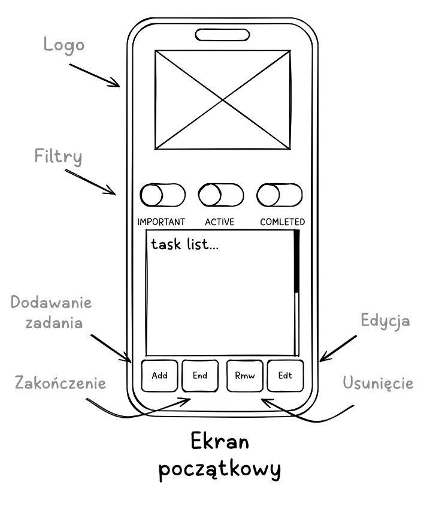

# Tworzenie szkiców interfejsu i mapy aplikacji
## Architektura informacji i User Flow
Zanim przystąpiono do szkicowania, opracowano ścieżkę użytkownika (User Flow), aby zapewnić logiczne przejścia między widokami. Główny proces obejmuje:

1. **Ekran główny**: Przegląd listy zadań z możliwością filtrowania.
2. **Akcja dodawania**: Przejście do formularza, wprowadzenie danych i powrót z informacją zwrotną.
3. **Zarządzanie zadaniem**: Możliwość edycji tytułu zadania, opisu, daty końcowej.
4. **Usunięcie wykonanych zadań**: Pogląd wykonanych zadań z podalszym ich usunięciem.

## Szkice Low-Fidelity Wireframes
Do projektowania prototypów w niskiej rozdzielczości był wybrany program [Frame0](http://frame0.app). Program jest dostępny na OS Windows, GNU/Linux oraz Mac. Jest w wersji bezpłatnej podstawowej oraz płatnej rozszerzonej. Posiada intuicyjny intefrejs, sterowanie podobne do Balsamiq i Figma. Dysponuje wystarczającą biblieteką standardowych elementów interfejsu.

Na tym etapie przygotowano szkice ramowe (wireframes) dla kluczowych ekranów aplikacji, z uwzględnieniem wersji mobilnej oraz desktopowej. [GitHub](https://github.com/ysychov1990/TODO_APP/tree/main/frame0) (Smartphone.f0 i Desktop1.f0)

### Wersja Mobilna

Zgodnie z potrzebami **Persony 2 i 3**, wersja mobilna stawia na obsługę "w biegu":

- Interfejs jednokolumnowy z dużymi obszarami klikalnymi (tzw. touch targets).
- Układ automatycznie dostosowuje się do mniejszych rozdzielczości, zachowując czytelność priorytetów.

### Wersja Desktop
Według potrzeb **Persony 1 oraz 2** Projekt skupia się na wykorzystaniu szerokości ekranu, aby umożliwić:

- Podobieństwo wersji dekstopowej i wersji mobilnej wraz z łatwością użytkowania.
- Sidebar z osobnym miejscem na dodanie lub przegląd zadań oraz główny panel z listą zadań
- Dodatkowe wskazówki ekranowe.

## Uzasadnienie rozwiązań na etapie szkicowania
* **Prostota**: Zrezygnowano ze skomplikowanych menu na rzecz czystego widoku listy, co realizuje zasadę prostoty UI.
* **Elastyczność**: Wprowadzono modularny układ, co ułatwia późniejszą implementację funkcji dodawania, edycji i usuwania zadań.
