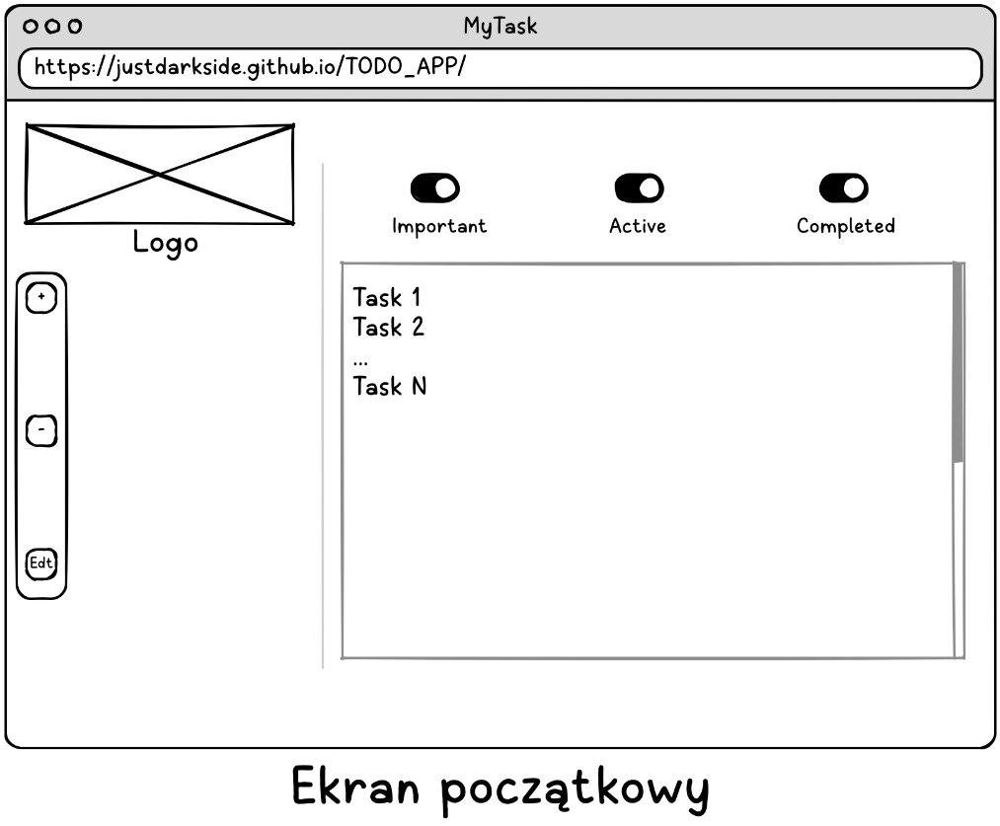

# Pliki Frame0

Aplikacja do projektowania interfejsów Lo-Fidelity: [Frame0](https://frame0.app)

| Plik | Opis |
| :--- | ---: |
| [Smartphone.f0](Smartphone.f0), [Smartphone2.f0](Smartphone2.f0) | Układy ekranowe do smartphonów |
| [Desktop1.f0](Desktop1.f0), [Desktop2.f0](Desktop2.f0) | Układy ekranowe do desktopów |
| [userflow.f0](userflow.f0) | Mapa przepływu użytkownika |

Zrzuty ekranowe:

